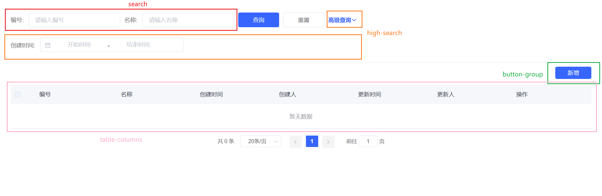

# CtTable 组件说明
组件用于数据列表页面，综合了数据表格展示、数据筛选和数据操作，预设了数据加载 loading 动画，表格多选，数据筛选状态记录等。



组件分为四个部分

- 搜索区-普通筛选(红框)，对应 search 插槽；
- 搜索区-高级筛选(橙框)，对应 high-search 插槽；
- 按钮组(绿框)，对应 button-group 插槽；
- 表格(粉框)，对应 table-columns 插槽；

## 区域
- search 区域 -
该区域主要放置与表格”筛选“相关的组件。
- high-search 区域 -
该区域主要放置与表格”高级筛选“相关的组件。
- button-group 区域 -
该区域放置与表格数据相关的按钮组。
- table-columns 区域 -
该区域放置 element-ui 的 [Table-column](https://element.eleme.io/#/zh-CN/component/table#table-column-attributes)，说明表格字段与数据的展示方式。

```
每个插槽的 prop 主要包括：setParams/params/selections
setParams
设置表格筛选表单
类型： (params: {}) => void;
参数： 要更新的表单对象
params
当前筛选表单值
类型： Object
selections
表格多选选中的行对象
类型： Object[]
```

## 属性
### request
必填，获取数据的方法

类型：({params: {}, page: number}) => Promise({list: [], pages: number, total: number, extra: {}})

参数： 一个包含筛选条件 params 和当前页码 page 的对象。

返回： 必须提供一个 Promise 实例，该实例要返回的对象包含两个必填属性和两个可选属性：list，必填，表格展示的数据数组；pages，必填，总页码数；total，可选，数据总数；extra，可选，扩展字段。

### rowKey
可选，数据主键，主要用于多选操作，如批量删除

类型：string

默认值：es_id


### isSelect
可选，设置是否可以多选

类型：Boolean

默认：true

### isPage
可选，设置是否有翻页

类型：Boolean

默认：true

### hasSearch

可选，设置是否显示搜索区

类型：Boolean

默认：true

### hasBtn

可选，设置是否显示按钮工具栏

类型：Boolean

默认：true

### hasHighSearch

可选，设置是否有高级筛选

类型：Boolean

默认：false

### requestTab

可选，设置是否有tab切换。传递即表示该页面有tab切换，若无不传这个属性即可。

类型：("字典code") => Promise({ list: [] })

参数： 字典code

返回： 必须提供一个 Promise 实例，该实例要返回的对象包含一个必填属性：list，必填。

### tabsActive

可选，设置是否tab的默认值。与requestTab搭配使用。

类型：String

默认："1"


## 接口
### reload()
根据当前筛选条件及页码刷新表格数据。

### reset()
根据当前筛选条件及页码更新为第一页刷新表格数据。

### setParam(key: string, value: any): void
设置筛选条件，执行函数后表格会自动刷新数据，无需调用reload()。


### setParams(data: object): void
设置多条筛选条件，执行函数后表格会自动刷新数据，无需调用reload()。
